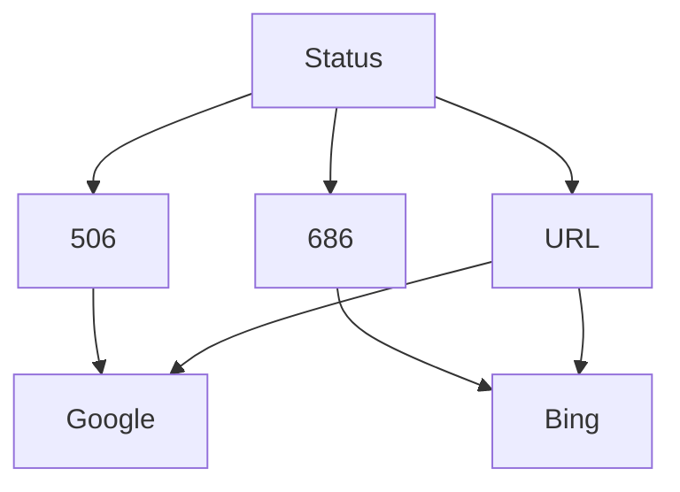

# The best use Uptimers in You Repos

The use mermaid to use Uptimers it!

🤖Robot: @beepboop-uptimers

🕯Live [Status](https://Uptimers.github.io/Uptimers) are good, please use Live Status To Get Your Own Repository Status by Uptimers

